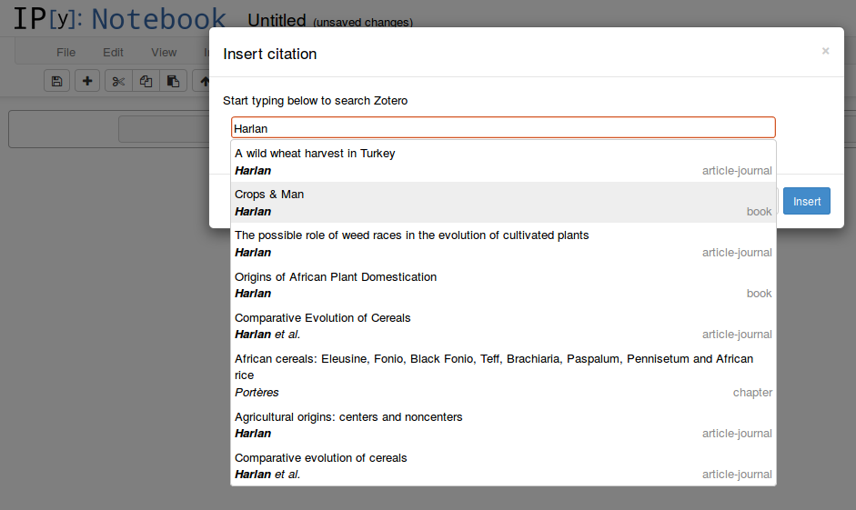

Live citations in IPython notebooks



To use it, symlink this directory to `~/.ipython/nbextensions/cite2c`, and add to your custom.js:

```javascript
IPython.load_extensions('cite2c/main');
```

You will see two new toolbar buttons: .
The left one inserts a citation at the current point in a Markdown cell.
The right one inserts a bibliography.

This extension has two main components:
- UI for finding citations from a Zotero library and inserting them into Markdown cells.
  The citations are stored in the notebook metadata, and referenced by an ID.
- Code to run [citeproc-js](https://bitbucket.org/fbennett/citeproc-js/wiki/Home) when a Markdown cell is rendered, rendering both bibliographies and inline citations.
